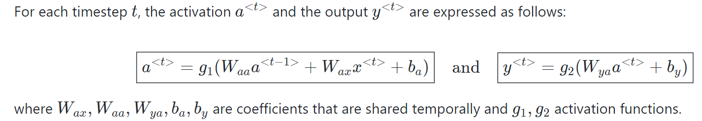

1. understand RNNs (including the mathematical notations)

   *  A recurret neural network (RNN) is a type of artificial neural network which uses sequential data or time series data.

   * Commonly used for solving problems such as language translation, natural language processing (nlp), speech recognition and image captioning.

   * NNs are a type of neural network that can be used to model sequence data. RNNs, which are formed from feedforward networks, are similar to human brains in their behaviour.

   * RNN uses a hidden layer to overcome the problem of remembering the previous input.

   * he most important component of RNN is the Hidden state, which remembers specific information about a sequence.

   * RNNs have a Memory that stores all information about the calculations. It employs the same settings for each input since it produces the same outcome by performing the same task on all inputs or hidden layers.

   